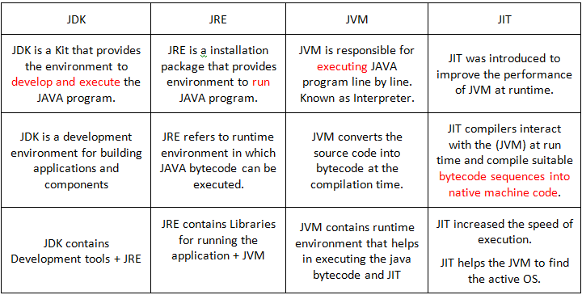
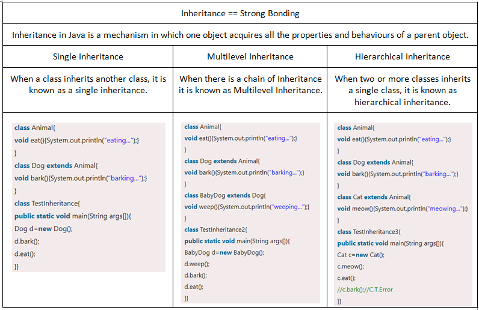
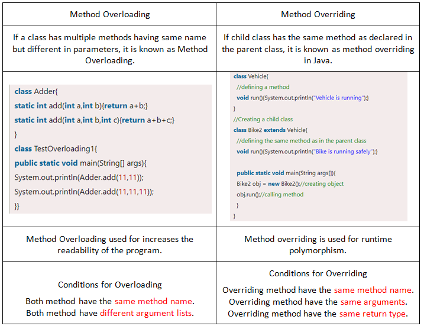

# JAVA-All-Basic

Java is a general-purpose and object oriented programming language originally developed by Sun Microsystem and released in 1995. It is plateform independent

what are the features of JAVA: 
1.	Simple: JAVA is easy to learn and it’s syntax is quite simple, clean and easy to learn. 
2.	Object Oriented: In java everything is Object which has some data and behaviour. 
3.	Robust 
4.	Platform Independent: Java is guaranteed to be write-once, run-anywhere language. Not fully Independent. JVM is Platform Independent.  
5.	Secure: Java program always runs in Java runtime environment with almost null interaction with system OS, hence it is more secure. 
6.	Multi threading: Java multithreading feature makes it possible to write program that can do many tasks simultaneously. 
7.	Portable: Java Byte code can be carried to any platform. 
8.	Highly Performance: Java enables high performance with the use of just-in-time compiler. 

Why we can say that Java is Plateform independent language ?  
 Java is a platform-independent programming language. Java doesn’t require the entire code to be rewritten for all the different platforms. It supports platform independence using Java bytecode and Java Virtual Machine. Java compiler javac converts the program code into byte code. This byte code is platform-independent and can run on any JVM operating system. JVM interprets the byte code to machine code, and the program is executed.
 
 is java case senstiive ? 
  Java is a case-sensitive language, which means in code showData and showdata are two different variables. Java is case-sensitive because it uses a C-style syntax.
  
 >**Class:** A class is a group of objects which have common properties or Class is a Blueprint, which holds it's own data members and members function. It's a Logical entity. different types of class in java: 

1. POJO class 
2. static class 
3. concrete class 
4. abstract class 
5. final class 
6. inner class
 
 what is POJO class in java ? 
 A class which contains only private variables and setter and getter methods to use those variables is called POJO class.
 
 what is concrete class in java ? 
 Any normal class which does not have any abstract method or a class having an implementation for all of its methods is basically a concrete class.
 
 what is abstract class in java? 
 An abstract class is declared with an abstract keyword and have zero or more abstract methods.
 
 what is final class? 
 Once a variable, method or a class is declared as final, it’s value remains the same throughout. class that has been declared final cannot be subclassed or inherited.
 
>**Object:** An entity that has state and behavior is known as an object e.g., chair, bike, marker, pen, table, car, etc. It's an Physical representation of things or we can say that it's a Instance of a class. Object contains Attributes and Methods.

There are 3 ways to initialize object in Java. 
1. By reference variable 
2. By Method 
3. By constructor

There are 3 ways to get object of Class class. 
1. forName() method of Class class
2. getClass() method of Object class
3. the .class syntax

**Method:** A method is a block of code or collection of statements to perform a certain task or operation. Used to achieve the reusability of code.
>Method Overloading: If a class has multiple methods having same name but different in parameters, it is known as Method Overloading. 

>Method Overriding: If a child class has a same method as declared in a parant class, it is known as Method Overriding.

There are two ways to overload the method in java 
1. by changing the number of arguments  
2. by changing the data types

why method overloading is not possible in java by changing the return type of methods only ? 
In java, method overloading is not possible by changing the return type of the method only because of ambiguity.

What is Method hiding ? 
if a subclass defines a static method with the same signature as a static method in the super class, in such a case, the method in the subclass hides the one in the superclass. The mechanism is known as method hiding. in such case method in subclass will be executed. 
  
 What is the difference between Method hiding and Overriding ? 
 In Method Overriding child class can access parent class method implementation. In case of Method Hiding parent class method implementation cannot be accessed through child class reference.

What is Static method? 
A method that belongs to a class rather than an instance of a class is known as a static method. 

What is Instance method? 
The method of the class is known as an instance method.

>What is Inheritance ? 
>
Inheritance is a mechanism in which child class acquires the property of parent class.

why do we need inheritance ? 
Inheritance enables code reusability and saves time. 
it is also used for Method Overriding.

>What is Polymorphism ? 

Polymorphism in Java is a concept by which we can perform a single action in different ways. or Polymorphism is the ability of an object to identify as more than one type.  

Two types of Polymorphism in Java: <a href="https://github.com/Chirag-ahir/JAVA-All-Basic/tree/main/polymorphism">Example</a>
1. Dynamic polymorphism: Dynamic polymorphism is a process in which a call to an overridden method is resolved at run time. That's why it's called runtime polymorphism. Ex. Method overriding 
2. Static polymorphism:  A polymorphism that is resolved during compile time is known as static polymorphism. - Compile time polymorphism Ex. Method overloading 

why do we need polymorphism ? 
It provides reusability to the code. The classes that are written, tested and implemented can be reused multiple times. 
A single variable can be used to store multiple data values. 
With lesser lines of code, it becomes easier for the programmer to debug the code.

what is coercion ? 
Coercion deals with implicitly converting one type of object into a new object of a different kind.

>What is Abstraction ?  

Hiding internal details and showing functionality to the user is known as abstraction. For example phone call, we don't know the internal processing. <a href="https://github.com/Chirag-ahir/JAVA-All-Basic/tree/main/abstraction">Example</a>

2 types of abstraction in java :
1. data abstraction
2. control abstraction

What is Abstract class  
An abstract class in Java is a class that can't be instantiated. Any abstract class can have both abstract as well as non-abstract methods.

What is Abstract method ? 
A method in Java that only has the declaration and not implementation is known as an abstract method. Also, an abstract method name is followed by the abstract keyword. 

what do you know about abstraction ? 
you can not create an object from the abstract class using the new operator. 
an abstract class can have a constructor 
abstract class can contain both abstract as well as concrete methods. 
only classes or methods can be declared as abstract, we can not declare a variable as abstract. 
we use the keyword abstract to declare both class and method as abstract. 
If we declare any method as abstract, the class automatically needs to become an abstract class.

>What is Encapsulation ?  

Binding code and data together into a single unit are known as encapsulation.

why we need encapsulation ? 
It controls the way of data accessibility 
Modifies the code based on the requisites 
Helps us to achieve a loose couple 
Achieves simplicity of our application

What is Access Modifier ?  
Access modifiers are keywords that can be used to control the visibility of fields, methods, and constructors in a class.

>Four types of Access modifier in Java :
1. Private: The access level of a private modifier is only within the class. It cannot be accessed from outside the class. 
2. Default: The access level of a default modifier is only within the package. It cannot be accessed from outside the package. If you do not specify any access level, it will be the default. 
3. Protected: The access level of a protected modifier is within the package and outside the package through child class. If you do not make the child class, it cannot be accessed from outside the package. 
4. Public: The access level of a public modifier is everywhere. It can be accessed from within the class, outside the class, within the package and outside the package. 

What is Public static void main (String args[]) ? 

>Public - It is an access specifier that means the main() method is accessible globally available. The public keyword tells the JVM that the scope of the code written is the whole project.

>Static - It is an access modifier means we can call this method directly using the class name without creating an object of it.

>Void - void is a no return datatype. It is a keyword and is used to specify that a method doesn't return anything. 

>Main - It is the name of the method. The main method is the entry point of a Java program for the Java Virtual Machine(JVM). Without main() method JVM will not execute the program. 

>String args[] - It is array of string type and It stores Java command-line arguments. 

What is System.out.println()?  
In Java, System.out.println() is a statement which prints the argument passed to it. Where 
>System is the class name. 
>The out is an instance of the System class.  
>The println() method display results on the monitor.  

What is System.in in Java? 
System.in is an InputStream which is typically connected to keyboard input of console programs.

What are Keywords in Java ? 
Keywords are predefined, reserved words used in Java programming that have special meanings to the compiler. 
  
>New keyword - In java, New keyword is basically used for creating objects. It allocates memory for an object.

>Extend keyword - The extends keyword indicates that you are making a new class that derives from an existing class. The meaning of "extends" is to increase the functionality.
  
>Static keyword - The static keyword is a non-access modifier used for methods and attributes. Static methods can be accessed without creating an object of a class.
  
>Super keyword - The super keyword in Java is a reference variable which is used to refer immediate parent class object.

>Final keyword - The final keyword is a non-access modifier used for classes, attributes and methods, which makes them non-changeable. 
  
>This keyword - This keyword is used to refer to the current class properties like method, instance, variable and constructors.
 
 can we call constructor using super keyword ? 
 The super keyword refers to superclass (parent) objects. It is used to call superclass methods, and to access the superclass constructor. The most common use of the super keyword is to eliminate the confusion between superclasses and subclasses that have methods with the same name. <a href="https://github.com/Chirag-ahir/JAVA-All-Basic/tree/main/Super">Example</a>
  
Blank final variable: A final variable that have no value it is called blank final variable or uninitialized final variable.

What is JAR File ? 
A Java™ ARchive (JAR) file is a file format that combines many files into one.

DataType : A data type, in programming, is a classification that specifies which type of value a variable has and what type of mathematical, relational or logical operations can be applied to it without causing an error.
  
  what is premitive data type in java ? 
  Primitive types are predefined data types in Java. 
  
  Eight Premitive Datatypes in JAVA 
  
 > Byte - 1 Byte 
  
 >Short - 2 Byte
  
  >Int - 4 Byte
  
  >Long - 8 Byte
  
  >Float - 4 Byte
  
  >Double - 8 Byte
  
  >Boolean - 1 Bit
  
  >Char - 2 Byte

**Variable:** Variable is a reserved location in a memory to store some value. 

  Three types of variables in JAVA

 > Instance variables are declared in a class, but outside a method, constructor or any block.

> Local variables are declared in methods, constructors, or blocks.

> Class variables also known as static variables are declared with the static keyword in a class, but outside a method, constructor or a block.
  
  What is instance variable ? 
  Instance variables in Java are non-static variables which are defined in a class but outside any method, constructor or a block.
  
  What is the difference between Instance variable and class variable? 
  In case of instance variable Every object will have its own copy of instance variables, hence changes made to these variables through one object will not reflect in another object while Class variables are common to all objects of a class, if any changes are made to these variables through object, it will reflect in other objects as well. <a href="https://www.edureka.co/blog/instance-variable-in-java/">Detailed demo 

**What is Constructor?** 
  A constructor is a special method that is used to initialize objects. The constructor is called when an object of a class is created.

Two types of constructors in JAVA
>No arg Constructor (Default Constructor) : A constructor with no arguments is called a default constructor. If we do not create a constructor of a class, Java creates a default constructor with data members which has values like zero, null, etc. 
  
>Parameterized Constructor : A constructor which has a specific number of parameters is called a parameterized constructor. 
 
 rules for constructor: 
 1. Constructor name must be the same as its class name 
2. A Constructor must have no explicit return type 
3. A Java constructor cannot be abstract, static, final, and synchronized 

What is Constructor Overloading ? 
Constructor overloading means having more than one constructor with the same name. Constructors are methods invoked when an object is created.
  
What is the difference between method and constructor ? 
  Constructor is used to create and initialize an Object while Method is used to execute certain statements.  
 Method name need not be same as the class name constructor name has to be same as the class name 
 Method has a return type constructor does not have a return type 
 You can call a method any number of times Constructor is called when an object is created

What is Expression in JAVA ?  
Expressions are essential building blocks of any Java program, usually created to produce a new value, although sometimes an expression simply assigns a value to a variable.
  
What is Recursion in JAVA ?  
Recursion in java is a process in which a method calls itself continuously. A method in java that calls itself is called recursive method.

  What is Basecase ? 
  The base case is a way to return without making a recursive call. In other words, it is the mechanism that stops this process of ever more recursive calls.
Java was a interpreted programming language , but after introducing JIT it was called as interpreted - compiled programming language<b>
  

  

  
 What is JDK ? Mention the variants of JDK.  
  JDK is a combined package of JRE and Developers tools used for designing JAVA applications. Oracle has the following variants. 
  1. JDK Sandard edition 
  2. JDK  Enterprise edition 
  3. JDK Micro edition 
  
 What is JRE ? 
  The JRE is the on-disk system that takes your Java code, combines it with the needed libraries, and starts the JVM to execute it. The JRE contains libraries and software needed by your Java programs to run.
  
 What is JVM ? 
  JVM is a virtual machine that enables the computer to run the Java program. JVM acts like a run-time engine that calls the main method present in the Java code.

  
  

  
 What are the conditions for Method overriding? 
 1. The method name should be common and the same as it is in the parent class.
 2. The method signature (parameter list, return type) in the method must be the same as in the parent class.
 3. There must be an inheritance connection between classes.

Can we call child class method using parant class object ?  
<a href="https://www.sololearn.com/Discuss/1351734/why-we-can-t-call-child-specific-methods-with-the-help-of-parent-reference-on-child-object-in-java#:~:text=Then%20the%20child%20class%20can,by%20using%20a%20parent%20reference.">Answer </a>

What is Associativity? 
Associativity specifies the order in which operators are executed, which can be left to right or right to left.

What is Association ? 
Association in Java is a connection or relation between two separate classes that are set up through their objects.
  
 What is Aggregation ? 
 When an object A contains a reference to another object B or we can say Object A has a HAS-A relationship with Object B, then it is termed as Aggregation. The aggregation has a weak association between objects.	Both objects can exit independently.
  
  What is Composition ? 
  Composition in java is the design technique to implement has-a relationship in classes. The composition has a strong association between objects.Both objects can not exit independently.

What is JIT ? 
JIT is an abbriviation for Just-in-Time Compiler. It increases efficiency of the interpreter by compiling the bytecode into native machine code at runtime.
  
   Advantages of JIT compiler :  
  1. The JIT compiler requires less memory usage  
  2. Code optimization can be done while the code is running. 
  3. It reduces the page faults. 
  4. It uses different levels of optimization.
  5. JIT increase the speed of program execution.

What is ClassLoader ? 
A classloader in Java is a subsystem of JVM, dedicated to load class files when a program is executed, Classloader is the first one to load the executable file. There are three built-in classloaders in Java. 

>1. Bootstrap ClassLoader: This is the first classloader which is the superclass of Extension classloader. It loads the rt.jar file which contains all class files of Java Standard Edition. 

>2. Extension Classloader: This is the child classloader of Bootstrap and parent classloader of System classloader. It loads the jar files located inside $JAVA_HOME/jre/lib/ext directory. 

>3. System classloader: This is the child classloader of Extension classloader. It loads the class files from the classpath. By default, the classpath is set to the current directory. 

What are the Memory Allocations available in Java ?  
>Class memory

>Heap memory

>Stack memory

>Program counter memory

>Native method stack memory
  
  what is heap memory? 
  heap memory is created when the JVM starts up and used by the application as long as the application runs. Whenever we create objects it occupies space in the heap memory while the reference of that object creates in the stack.
  
  what is stack memory? 
  The stack memory is a physical space allocated to each thread at run time. It is created when a thread creates. 
 
  What is the difference between Heap memory and Stack memory ? 
 The major difference between Stack memory and heap memory is that the stack is used to store the order of method execution and local variables while the heap memory stores the objects and it uses dynamic memory allocation and deallocation.
  
  ex. public void m(){ 
      ArrayList<String> list = new ArrayList<String>(); 
  } 
  here list is reference will store in stack memory and ArrayList is a object will store in heap memory. 

Will the program run if we write static public void main? 
Yes, program will run successfully. In Java there is no specific rule for order of specifiers. 

What is the default value stored in Local variable? 
Neither the local variable nor any primitives and Objet have any default value stored in them. 

Define Copy constructor in Java ?  
A Copy Constructor in Java is a constructor that initializes an object through another object of the same class. 

What is Interface in Java ? 
interface is a template that has only method declarations and not method implementations. It is a workaround for achieving multiple inheritances in Java. <a  href="https://github.com/Chirag-ahir/JAVA-All-Basic/tree/main/interface">Example</a>
  
  what do you know about interface ? 
  A class that implements the interface must provide an implementation for all methods declared in the interface. 
All methods in an interface are internally public abstract void. 
All variables in an interface are internally public static final. 
Classes do not extend but implement interfaces.
  
 Why do we use Interface in Java? 
  --> It's used to achieve total abstraction. 
  --> Since java does not support multiple inheritance in case of class, by using Interface we can achieve it. 
  --> It's also used to achieve loose coupling. 
  --> It's used to implement abstraction.
  
What is Marker Interface ? 
An empty interface in Java is referred as a Marker interface. Serializable and Cloneable are some popular ex. of Marker Interface. It provides run-time type information about objects,
  
  What is Functional Interface ? 
  An interface that contains only one abstract method is known as functional interface. It can have any number of default and static methods. 
  
  what is consumer interface ? 
  consumer interface represents an operation that accepts a single input argument and returns no result.
  
  Following are the functional interface instroduced in the Java8 
  1. Function 
  2. Predicate 
  3. Consumer 
  4. Supplier 

 What is the difference between Interface and Abstract class ? 
  the main difference between an interface and an abstract class is that an interface cannot have state, whereas the abstract class can have state with instance variables.
  
What is Package in Java? 
Package is a collective bundle of classes and interfaces along with the necessary libraries and JAR files. 

Advantages of package
>Reusability 
>Name conflicts 
>Controlled acccess 
>Data encapsulation 
>Maintenance

What is Object Cloning ? 
An ability to create an object completely similar to an existing object is known as Object Cloning. 
 
 What is the difference between Shallow copy and Deep cloning? 
  In Shallow copy, a copy of the original object is stored and only the reference address is finally copied. In Deep copy, the copy of the original object and the repetitive copies both are stored.
  
  What is Shallow cloning? 
when the cloning process is done by invoking the clone() method it is called Shallow Cloning. It is the default cloning process in Java where a shallow copy of the original object will be created with exact field.
  
  What is Deep cloning? 
   when the cloning process is done by implementing the Cloneable interface it is called Deep Cloning. In this type of cloning, an exact copy of all the fields of the original object will be created. 

What is Wrapper classes in Java ? 
In Java when you declare primitive datatype then Wrapper classes are responsible for converting them into objects.
  
  what is pointer ? 
  A POINTER IS JUST THE ADDRESS OF SOME location in memory.
  
Why pointers are not used in Java ? 
1. They are unsafe 
2. They increase the complexity of program.  
3. JVM takes care of memory management implicitly. So we can not use pointers in Java.

Differentiate between Instance and Local variable. 
Instance variables are declared inside a class and the scope is limited to only a specific object. Local variable can be anywhere inside a method or a specific block of code. Also the scope is limited to the block of code where the variable is declared. 
  
What is String Pool ? 
A collection of strings in Java's Heap memory is referred as Java String pool. 

What is Execption in Java ? 
An exception is an event, which occurs during the execution of a program, that disrupts the normal flow of the program.
  
 What is custome exception in Java ? 
  User-Defined Exception or custom exception is creating your own exception class and throwing that exception using the 'throw' keyword.
  
 What is Exception Handling in Java ? 
 Java Exception Handling is a mechanism to handle runtime errors such as ClassNotFoundException, IOException, SQLException, RemoteException, etc. Exception is an unwanted or unexpected event, which occurs during the execution of a program. There are mainly two types of exceptions in Java as follows: 
  
>Checked exception: Checked exceptions are also known as compile-time exceptions as these exceptions are checked by the compiler during the compilation process to confirm whether the exception is handled by the programmer or not. If not, then the system displays a compilation error. For example, SQLException, IOException, InvocationTargetException, and ClassNotFoundException.

>Unchecked exception: The unchecked exceptions are those exceptions that occur during the execution of the program. Hence they are also referred to as Runtime exceptions. These exceptions are generally ignored during the compilation process. They are not checked while compiling the program. For example, programming bugs like logical errors, and using incorrect APIs. Ex. ArithmeticException, NullPointerException, NumberFormatEception.
  
  Explain Exception hierarchy 
  
  

  All exception and error types are subclasses of class Throwable, which is the base class of hierarchy. One branch is headed by Error which occurs at run-time and other by Exception that can happen either at compile time or run-time.
  
  

What is Access Specifier and Types of Access specifier? 
Access Specifiers are predefined keywords used to help JVM with understanding the scope of a variable, method and class. We have four access specifier 
  > Public access specifier - Visible to All classes. 
  > Private access specifier - Visible only to the class. 
  > Protected access specifier - Visible to classes with in the package and the subclasses of other package. 
  > Default access specifier - Visible to the classes with the package 

 What is Late binding ? 
Binding is a process of unifying the method call with the method's code segment. Late binding happens when the method's code segment is unknown till the method is called during the run-time. 
  
What is Run time polymorphism ? 
Runtime polymorphism, also known as the Dynamic Method Dispatch, is a process that resolves a call to an overridden method at runtime. The process involves the use of the reference variable of a superclass to call for an overridden method. Method overriding is an example of run time polymorphism.

  What is Compile time polymorphism? 
Compile time polymorphism refers to a process in which a call to an overloaded method is resolved at compile time rather than at run time. Method overloading is an example of compile time polymorphism.
  
 Brief the life cycle of Applet ? 
  1. Initialization 
  2. Start 
  3. Stop 
  4. Destroy 
  5. Paint 
  
What is Garbage collection in Java ? 
Garbage collection is the mechanism used in Java to de-allocate unused memory, which is nothing but clear the space consumed by unused objects.
  
  why we use GC ? 
  It makes java memory efficient because garbage collector removes the unreferenced objects from heap memory. 
  Developers not need to worry about explicit memory management because JVM does it automatically.
  
  how many ways to unreference the object ? 
  1.By nulling the reference e1 = null;  
2. By assigning a reference to another e1 = e2; 
3. By anonymous object etc. new employee(): 
  
What is enumeration in Java ? 
An enumeration in Java is a special data type which contains a set of predefined constants.

Why Java is consider as a Dynammic? 
Java is considered as Dynamic because of Byte code. A source code written in one platform, that can be executed in any platform. And it also loads the class files at run time. Anything that happens at run time is considered as Dynamic.
  
What is JSP ? 
JSP is an abbreviation for Java Servlet Page. The JSP page consist of two types of text. 
  1. Static data 
  2. JSP elements 
  
What is JDBC ? 
JDBC is an abbreviation for JAVA Database connector. JDBC is an abstraction layer used to establish connectivity between an existing Database and a java application.

What is JCA ? 
Java Cryptography Architecture provides a plateform and gives architecture and APIs for encryption and decryption. JCA is used by the developer to combine the application with the security measure. It helps in performing the third party security rules. 
  
What is JPA in Java ? 
The Java Persistence API is a Java specification for accessing, persisting, and managing data between Java objects / classes and a relational database. JPA deals in following  
1. Java Persistence API  
2. Query language 
3. Java Persistence Criteria API 
4. Object Mapping Data 

What is Session Management ? 
Session management refers to the process of securely handling multiple requests to a web-based application or service from a single user or entity.

What is Spring Framework ? 
The Spring Framework is an application framework and inversion of control container for the Java platform.
  
  What is Lambada Expression ? 
A lambda expression is a short block of code which takes in parameters and returns a value. Lambda expressions are similar to methods, but they do not need a name and they can be implemented right in the body of a method.

Why string is immutable in Java ? 
String pool requires string to be immutable otherwise shared reference can be changed from anywhere. and other reason havong string immutable allows you to be secure and safe because no one can change reference of string once it gets created. 
  
What is Singleton class ? 
A singleton class is a class that can have only one object at a time. 

  What is the Difference between "=" and "==" operator? 
  The “=” is an assignment operator is used to assign the value on the right to the variable on the left. The '==' operator checks whether the two given operands are equal or not. If so, it returns true. Otherwise it returns false.
  
  What is the difference between == and .equals()? 
  In simple words, == checks if both objects point to the same memory location whereas .equals() evaluates to the comparison of values in the objects. 
  _== method used with premitive types of variables like Short, Int, Bool, Float, Double, Long while .equals method used with reference type of variables like String, Objects' _

  What is constant in Java? 
  A constant is a variable whose value cannot change once it has been assigned. Java doesn't have built-in support for constants.
  
  How to create constant in Java ? 
  In java there is no const keyword like C++ for declaring constant variable but we can use Final keyword for declaring constant in Java. 

  Can we declare a Class, Method and Variable as a constant in Java ? 
  Yes we can do it by using a Final keyword. but after declaring it as a constant we can not override method, we can not inherit class and we can not change the value of variable if it's a constant.

 What is the difference between Break and Continue statements ? 
The break and continue statements are the part of transfer statements in Java. The break statement terminates the whole iteration of a loop whereas continue skips the current iteration. The break statement terminates the whole loop early whereas the continue brings the next iteration early.
  
  What are the main Key difference between C++ and Java ? 
>C++ uses only compiler, whereas Java uses compiler and interpreter both.
  
>C++ supports both operator overloading & method overloading whereas Java only supports method overloading.
  
>C++ supports manual object management with the help of new and delete keywords whereas Java has built-in automatic garbage collection.
  
>C++ supports structures whereas Java doesn’t supports structures
  
>C++ supports unions while Java doesn’t support unions.

  What is Type casting in Java ? 
  Type casting is a method or process that converts a data type into another data type in both ways manually and automatically. The automatic conversion is done by the compiler and manual conversion performed by the programmer. Two types of Type casting in java
 > Implicit type casting: Converting a *lower data type into a higher one* is called widening type casting. It is also known as implicit conversion. It done automatically. 

  Ex. byte -> short -> char -> int -> long -> float -> double
  
 > Explicit type casting: Converting a *higher data type into a lower one* is called narrowing type casting. It is also known as explicit conversion. 
  
  Ex. double -> float -> long -> int -> char -> short -> byte

  
Can we Overload a main() method in Java? 
Yes, We can overload the main method in java but JVM only calls the original main method, it will never call our overloaded main method.
  
Can we Override a Static method in Java? 
  No, we cannot override static methods in Java because static methods are bounded at compile time using static binding. 

  What is the difference between Assignment and Initialization? 
Assignment gives a variable a value at some point after the variable is created so it's called assignment while Initialization gives a variable an initial value at the point when it is created. 
  
  What is a Byte code ? 
  Bytecode is computer object code that an interpreter converts into binary machine code so it can be read by a computer's hardware processor.

  Can we execute a java program without main method ? 
  Yes, we can execute a java program without a main method by using a static block. Static block in Java is a group of statements that gets executed only once when the class is loaded into the memory by Java ClassLoader, It is also known as a static initialization block.
  
  What is Jagged array in Java ? 
  Jagged array is a multidimensional array where member arrays are of different size.

  What are literals in Java? 
  Literals in Java refere to the data that is given in a variable or constant. Five types of Literals in Java 
  >String literals: Sequence of characters enclosed in double quotes 
  >Inegral and Float literals: Integer and foat numbers 
  >Booleam literals: Represent True or False 
  >Char literals: Character value enclosed in single quotes 

  What is meant by Java is plateform independent? 
  Java is platform-independent because it uses a virtual machine. The Java programming language and all APIs are compiled into bytecodes. Bytecodes are effectively platform-independent. The virtual machine takes care of the differences between the bytecodes for the different platforms.  
  
  Bydefault classes in Java are public or private? 
  By default all the classes in Java are public that's why we put Public keyword in beginning of classes.

  What if the main method is declared as Private? 
 Pogram will not execute. It searches for the main method which is public, static, with return type void, and a String array as an argument. If such a method is not found, a run time error is generated.

  What is Increment and Decrement operators ? 
  Increment and decrement operators are unary operators that add or subtract one, to or from their operand, respectively.

  What is Object oriented programming ? 
  Object oriented programming is a methodology to design a program using Classes and Objects.
  
  What is Upcasting ?  
  Upcasting is a type of object typecasting in which a child object is typecasted to a parent class object. 
  If the reference variable of parent class refers to the object of child class, it is known as upcasting.
  
  What is Downcasting ? 
  Downcasting means the typecasting of a parent object to a child object. Downcasting cannot be implicit.

  What is Loose coupling? 
  Loose coupling in Java means that the classes are independent of each other.
  
  what are different operators present in java? 
  1. Arithmetic Operators 
2. Assignment Operators 
3. Logical Operators 
4. Relational Operators 
5. Unary Operators 
6. Bitwise Operators 
7. Ternary Operators 
  
  What is Operator Overriding? 
  Operator Overriding a procedure where you can define an operator in both parent and child classes with the same signature, but with different operational capability.

What is Factory method? 
A factory method is a method that returns the instance of the class.

 What is Autoboxing? 
  The automatic conversion of **primitive data type into its corresponding wrapper class** is known as autoboxing.
  
  What is Unboxing? 
  The automatic conversion of **wrapper type into its corresponding primitive type** is known as unboxing. It is the reverse process of autoboxing.

  What is Covarient return type? 
  The covariant return types are newly introduced since Java 5.0, and used during method overriding. Covariant return type allows us to change the return type of the overriding method in the subclass;

  What is JDB ? 
  The Java Debugger (JDB) is a command-line java debugger that debugs the java class. It's used to find and fix bugs in the Java programs. 

  What is Diamond problem in Java? 
  The "diamond problem" is an ambiguity that arises when two classes B and C inherit from A, and class D inherits from both B and C. The diamond problem in Java is the main reason java doesn't support multiple inheritances in classes.

  What Are Command Line Arguments? 
The command-line arguments are passed to the program at run-time. Passing command-line arguments in a Java program is quite easy. They are stored as strings in the String array passed to the args parameter of main() method in Java.

What is Stack overflow error? 
A stack overflow is a type of buffer overflow error that occurs when a Java program tries to use more memory space in the call stack than has been allocated to that stack. 
  
  What is Out of memory error? 
  OutOfMemoryError is a runtime error in Java which occurs when the Java Virtual Machine (JVM) is unable to allocate an object due to insufficient space in the Java heap.
  
 What is For loop in java? 
  The Java for loop is a control flow statement that iterates a part of the programs multiple times with a specified condition.
  
  What is For-each loop? 
  In Java, the for-each loop is used to iterate through elements of arrays and collections (like ArrayList). It is also known as the enhanced for loop.

  What is Covariant return type? 
  Covariant return type refers to return type of an overriding method. It allows to narrow down return type of an overridden method without any need to cast the type or check the return type. 
  
  What is Instance initializer block? 
  Instance Initialization Blocks or IIBs are used to initialize instance variables. So firstly, the constructor is invoked and the java compiler copies the instance initializer block in the constructor after the first statement super(). They run each time when the object of the class is created. <a href="https://github.com/Chirag-ahir/JAVA-All-Basic/tree/main/IIB">Example</a>
  
  rules for IIB  
  The instance initializer block is created when instance of the class is created. 
The instance initializer block is invoked after the parent class constructor is invoked (i.e. after super() constructor call). 
The instance initializer block comes in the order in which they appear.

  What is Throw keyword in Java? 
  The throw keyword in Java is used for explicitly throwing a single exception. This can be from within a method or any block of code. Both checked and unchecked exceptions can be thrown using the throw keyword.
  
  What is throws keyword in java? 
  The throws keyword in Java is used to declare exceptions that can occur during the execution of a program. For any method that can throw exceptions, it is mandatory to use the throws keyword to list the exceptions that can be thrown.
  
 What is Unreachable catch block error? 
 When we are using multiple catch blocks for a single try block, the order of exceptions in the catch block must be placed in such a way that first, subclass exception comes and later on superclass exception. If we place superclass exception first and later on subclass exception, all the exceptions thrown for subclass exception will be caught by the first catch block. In this case, the second catch block will not be used in the program and java compiler will generate unreachable catch block error.

  What is IOException in Java? 
  Java IOExceptions are Input/Output exceptions (I/O), and they occur whenever an input or output operation is failed or interpreted. For example, if you are trying to read in a file that does not exist, Java would throw an I/O exception.

What is Interpreter ? 
Interpreter in Java is a computer program that converts high-level program statement into Assembly Level Language.  It is designed to read the input source program and then translate the source program instruction by instruction.

  What is Method Signature in Java? 
  Method Signature in java is defined as the structure of a method that is designed by the programmer. Method Signature is the combination of a method's name and its parameter list.
  
  

  What is Exception propagation? 
  Exception propagation is a way of propagating exception from method to method or it is a process in which the exception is being dropped from to the top to the bottom of the stack.
  
  What is the difference between Throw and Throws keyword? 
  The throw keyword is used to throw an exception explicitly from a method or a block of code. It can throw only one exception at a time. The throws keyword can be used to declare multiple exceptions, separated by a comma. Throws keyword is used in signature of the method.

  What is catch block in java? 
The catch block allows you to define a block of code to be executed, if an error occurs in the try block. It is used to handle the Exception by declaring the type of exception within the parameter.

  What is Multi catch block in java ? 
  When statements in a single try block generate multiple exceptions, we require multiple catch blocks to handle different types of exceptions. This mechanism is called multi-catch block in java.
  
  What is the difference between Final, Finally and Finalize ? 
  >final is the keyword and access modifier which is used to apply restrictions on a class, method or variable.	 
  
  >finally is the block in Java Exception Handling to execute the important code whether the exception occurs or not.	 
  
  >finalize is the method in Java which is used to perform clean up processing just before object is garbage collected.

 >The keyword final is an access modifier, finally is a block and finalize is a method. The keyword final is applicable to the classes, variables and methods of the classes finally is a block associated with the try catch block that is used to handle exceptions, finalize is a method that operates only on objects.
  

  What is Instance variable? 
  A variable which is created inside the class but outside the method is known as an instance variable.
                           
  What is process in java? 
  A process is a self contained execution environment and it can be seen as a program or application.
  
  What is Thread in java? 
  A thread is a single lightweight and smallest part of a process or It is the smallest unit of a process that can run alongwith the other parts of the same process. 2 ways to create thread: by extending thread class, by implementing runnable interface.
  
   what is the beteer way to create thread in java ? 
 By implementing Runnable interface is a better way to create a thread in java because when we create a thread by extending Thread class, all Thread class methods are inherited while we can perform the task with the one method (run method) only.
 
  what is the major difference between process and thread ? 
  The most significant difference between a process and a thread is that a process is defined as a task that is being completed by the computer, whereas a thread is a lightweight process that can be managed independently by a scheduler.
  
  what is thread class in java ? 
  Thread class is the main class on which Java's Multithreading system is based. Thread class, along with its companion interface Runnable will be used to create and run threads for utilizing Multithreading feature of Java.
  
  What is the difference between thread and process? 
 Process means a program is in execution, whereas thread means a segment of a process. 
A Process is not Lightweight, whereas Threads are Lightweight. 
A Process takes more time to terminate, and the thread takes less time to terminate. 
Process takes more time for creation, whereas Thread takes less time for creation. 
Process likely takes more time for context switching whereas as Threads takes less time for context switching. 
Process does not share data, and Threads share data with each other.
 
  What is Multi tasking? 
  Multitasking is the capability of an Operating System to execute more the one task or job simultaneously on a shared resource.
  
  What is Multi processing? 
  Multiprocessing refers to the ability of a system to run multiple processors concurrently, where each processor can run one or more threads.
  
  What is Multi threading? 
  Multithreading is the ability of an Operating System to execute more than one thread at the same time. We can achieve multithreading in Java in two ways: 
1. By Implementing the Runnable Interface 
2. By extending Thread class
  
  What are the advantages of Multithreading? 
 1. Threads are lightweight which has a low memory footprint 
2. The cost of communication between threads is low 
3. Access to memory state from another context is easier 
4. It allows you to make responsive UIs easily 
5. Allows multiple operations to perform at once 
6. Saves time for excution of multiple operations 
  
  What is the difference between Multithreading and Multiprocessing? 
  
  

  What are different thread priorities? 
  Min priority: 1 
  Default or normal priority: 5 
  Max priority: 10 

  What is Born thread? 
  Born Thread is a thread that has been created but not yet started. It remains in this state until we start it using the start() method.
  
  What is the thread life cycle? or What are different states of thread? 
  **New - Runnable - Running - Waiting - Dead** 
  
New: When the thread instance is created, it will be in “New” state. 
Runnable: When the thread is started, it is called “Runnable” state. 
Running: When the thread is running, it is called “Running” state. 
Waiting: When the thread is put on hold or it is waiting for the other thread to complete, then that state will be known as “waiting” state. 
Terminated: When the thread is dead, it will be known as “terminated” state. 
  
  Everything to explore multithreading: https://techvidvan.com/tutorials/java-multithreading/
  
  What is Thread scheduler? 
  Thread scheduler in Java is the component of JVM that determines the execution order of multiple threads on a single processor (CPU). It decides the order in which threads should run. This process is called thread scheduling in Java.
  
  What are the different thread methods? 
  start() – Starts the thread. 
getState() – It returns the state of the thread. 
getName() – It returns the name of the thread. 
getPriority() – It returns the priority of the thread. 
sleep() – Stop the thread for the specified time. 
Join() – Stop the current thread until the called thread gets terminated. 
isAlive() – Check if the thread is alive. 
  
  What is main thread? 
  The Main thread in Java is the one that begins executing when the program starts.
  
  What is yield method in thread? 
  A yield() method is a static method of Thread class and it can stop the currently executing thread and will give a chance to other waiting threads of the same priority.
  
What is Java inner class? 
inner class or nested class is a class that is declared entirely within the body of another class or interface. There are basically four types of inner classes in java 
  1. Member inner class: class inside class 
  2. Anonymous inner class: A class created for implementing an interface or extending class. JVM decide it's name. 
  3. Local inner class: class inside method 
  4. Static inner class: class inside class with static keyword
  
What is anonymous class? 
A nested class that doesn't have any name is known as an anonymous class. An anonymous class must be defined inside another class. Hence, it is also known as an anonymous inner class.
  
What happens if we start thread multiple times? or can we restart dead thread in java ? 
Program will throw runtime error IllegalThreadStateException error.
  
Which is the native method in Thread.sleep()? 
  The method sleep() with the one parameter is the native method, and the implementation of the native method is accomplished in another programming language. The other methods having the two parameters are not the native method.
  
  what is join method in multithreading ? 
  The join() method in Java is provided by the java.lang.Thread class that permits one thread to wait until the other thread to finish its execution.
  
  What is the difference between Thread.run() and Thread.start() ? 
  When a program calls the start() method, a new thread is created and then the run() method is executed. But if we directly call the run() method then no new thread will be created and run() method will be executed as a normal method call on the current calling thread itself and no multi-threading will take place.

  Which exception we are using in thread.sleep() method? 
  Whenever thread.sleep() method executes, it always pauses the current thread execution. If any other thread interrupts when the thread is sleeping, then InterruptedException will be thrown.
  
  what is the difference between wait and sleep method? 
  Wait() method releases lock during Synchronization. Sleep() method does not release the lock on object during Synchronization. Wait() should be called only from Synchronized context. There is no need to call sleep() from Synchronized context.
  
  What is the difference between thread.yield() and thread.join() ? 
  Yield tells the currently executing thread to give a chance to the threads that have equal priority in the Thread Pool while Join method in Java allows one thread to wait until another thread completes its execution. 
  Yield method only put a thread from Running State to Runnable State, not in wait or blocked state while Join method put current thread into blocking state until thread instance finish execution.

  What is IllegalArgumentException in Thread? 
  If the value of the parameter newPriority of the method setPriority() goes out of the range (1 to 10), then we get the IllegalArgumentException. IllegalArgumentException is a Java exception indicating that a method has received an argument that is invalid or inappropriate for this method's purposes.

 What is Daemon thread in java? 
 Daemon thread is a low-priority thread that continuously running in the background to perform tasks such as garbage collection. It's life depands on the user threads.

  How can we implement Daemon thread in Java? 
  By using the method thread.setDaemon() we can implement daemon thread.  For example, if I have a user thread tU then tU. setDaemon(true) would make it a Daemon thread.
  
  What are the different Daemon thread methods? 
  setDaemon(boolean status) : Marks this thread as either a daemon thread or a user thread(non-daemon thread). 
  isDaemon() : Used to test if this thread is a daemon thread or not. Returns true if the thread is Daemon else false.
  
  What if we set our current thread as a Daemon thread(t1.setDaemon(true)) after starting(t1.start()) it ? 
  It will throw IllegalThreadStateException error. Note: If you want to make a user thread as Daemon, it must not be started otherwise it will throw IllegalThreadStateException.
  
  What is Thread Group? 
Threadgroup represents a set of threads. it offeres a convineant way to manage groups of thread as a single unit. 
  
  what is the difference between activeCount() and activeGroupCount() ? 
  activeCount() returns a no. of active threads in thread group while activeGroupCount() returns a no. of active thread group and it's sub groups.
  
  What is Thread pool in java? 
  Java Thread pool represents a group of worker threads that are waiting for the job and reused many times. There are three thread pool methods 
  1. Executors.newFixedThreadPool(int)   
  2. Executors.newCachedThreadPool()
  3. Executors.newSingleThreadExecutor()
 
 what is ExecutorService interface ? 
 The ExecutorService interface extends Executor by adding methods that help manage and control the execution of threads. It is defined in java. util. concurrent package.
  
What is the difference between newFixedThreadPool and newCatchedThreadPool ? 
In newFixedThreadPool will keep all the threads running until they are explicitly terminated. In the newCachedThreadPool Threads that have not been used for sixty seconds are terminated and removed from the cache.
<a href = "https://stackoverflow.com/questions/949355/executors-newcachedthreadpool-versus-executors-newfixedthreadpool#:~:text=In%20terms%20of%20resources%2C%20the%20newFixedThreadPool%20will%20keep%20all%20the%20threads%20running%20until%20they%20are%20explicitly%20terminated.%20In%20the%20newCachedThreadPool%20Threads%20that%20have%20not%20been%20used%20for%20sixty%20seconds%20are%20terminated%20and%20removed%20from%20the%20cache.">Detailed annswer</a>

What is the difference between executorService.execute and executerService.submit method in java thread pool? 
Execute Method can accept only runnable task while Submit Method can accept both runnable and callable tasks. 
Execute Method has a return type of void while Submit Method has a return type of Future. 
  
 What is the difference between runnnable and collable class ? 
 A callable interface throws the checked exception and returns the result. A runnable interface, on the other hand, does not return a result and cannot throw a checked exception

  What is the use of executorService.shutdown() method ? 
  Once you call the shutdown() method task executor will not accept further task and it'll shut down after all running threads finish their current work.
  
  What is Deadlock in java? 
  Deadlock in Java is a condition where two or more threads are blocked forever, waiting for each other - Or - Deadlock is a situation where multiple threads are waiting for eachother to complete their operation.  

First object locked resource 1 and second object locked resource 2 
Now first object trying to access resource 2 which is acquired by second object 
and second object trying to access resource 1 which is acquired by first object. 
  
  What is thread leakage ? 
  Thread leakage is when we dont close the thread properly then the number of unused threads grows with time.
  
What is Generics in java? 
A Generic class simply means that the items or functions in that class can be generalized with the parameter(example T) to specify that we can add any type as a parameter in place of T like Integer, Character, String, Double or any other user-defined type.
  
  What is shutdown hook in java? 
  Shutdown Hooks are a special construct that allows developers to plug in a piece of code to be executed when the JVM is shutting down.

  What is the difference between thread.sleep() and thread.wait() ? 
  The Sleep () method is related to the Thread class that is used to stop the execution of the current Thread for few seconds. it will send current thread into runnable state. The Wait() method is related to the Object class. The Wait() method is responsible for sending the calling thread into the waiting state. The Thread remains in the waiting state until another thread doesn't invoke the notify() or notifyAll() method for that object.

  What is Hashmap ? 
  Java HashMap is a class which is used to perform operations such as inserting, deleting and locating elements in a map. We create a map, where we pass two kinds of values which are 'key' and 'value'.
  
  what is the difference between hashmap and hashtable ? 
  HashMap is non-syncronized and is not thread safe while HashTable is thread safe and is synchronized. HashMap allows one null key and values can be null whereas HashTable doesn't allow null key or value. HashMap is faster than HashTable.
  
  What is Garbage collection in java ? 
  Garbage Collection is the process of reclaiming the runtime unused memory by destroying the unused objects, in java it is performed automatically.

  What is the difference between SchedulerWithfixedRate and SchedulerWithfixedDelay ? 
  FixedDelay guarantees that executions happen in sequence and that there's a delay between the end of the previous execution and the start of the new one. With in fixedRate It guarantees that new execution starts after the specified time passed after the start of the previous.
  
  What is synchronization? 
Synchronization in Java is the capability to control the access of multiple threads to any shared resource. There are two types of synchronization 
1. Process Synchronization 
2. Thread synchronization
  
  Why we use synchronization? 
1. To prevent thread interference.
2. To prevent consistency problem.
  
 What is the difference between synchronized block and synchronized method ? 
 A synchronized method assigns an object-level or class-level corresponding lock. And synchronized block assign a lock to the object based on the parameter. 
A synchronized method lock on the entire functionality of the method concerned. And a synchronized block is used to acquire the lock on a small number of the consecutive statement.

  What is static synchronization ? 
  In simple words a static synchronized method will lock the class instead of the object, and it will lock the class because the keyword static means: "class instead of instance". 
  
  What is Race condition in java ? 
  Race condition in Java occurs in a multi-threaded environment when more than one thread try to access a shared resource (modify, write) at the same time.

  What is corepool size? 
  corepool size is the  minumum number of threads that remain active at any given point of time. 
  
  What is maxpool size? 
 maxpool size defines the maximum number of threads as that can ever be created. \
  
  What is Thread safe in java ? 
  Thread safe means that a method or class instance can be used by multiple threads at the same time without any problems occurring. Where as Synchronized means only one thread can operate at single time.

  what is file input stream in java ? 
  It is an abstract superclass of the java.io package and is used to read the data from an input source.
  
  what is file output stream in java? 
  It is an abstract superclass of the java.io package and writes data to an output resource. In other words, writing the data into the files.
  
  what is try with resources in java ? 
  In Java, the try-with-resources statement is a try statement that declares one or more resources. The try-with-resources statement ensures that each resource is closed at the end of the statement execution.
  
  what is flush() method in java io? 
  It flushes the current output stream and forces any buffered output to be written out.

what is buffered output stream? 
Java BufferedOutputStream class is used for buffering an output stream. It internally uses buffer to store data. It makes the performance fast. 
 
 what is buffered input stream? 
 Java BufferedInputStream class is used to read information from stream. It internally uses buffer mechanism to make the performance fast.
 
 what is sequence input stream class? 
 Java SequenceInputStream class is used to read data from multiple streams. It reads data sequentially

What is byte array output stream? 
Java ByteArrayOutputStream class is used to write common data into multiple files. In this stream, the data is written into a byte array which can be written to multiple streams later.

what is byte array input stream? 
The ByteArrayInputStream is composed of two words: ByteArray and InputStream. As the name suggests, it can be used to read byte array as input stream.
  
  what is data input stream? 
  Java DataInputStream class allows an application to read primitive data from the input stream in a machine-independent way.

  what is file writer in java? 
  Java FileWriter class is used to write character-oriented data to a file. It is character-oriented class which is used for file handling in java.
  
  what is file reader in java? 
  Java FileReader class is used to read data from the file. It returns data in byte format like FileInputStream class.

what is filter writer? 
Java FilterWriter class is an abstract class which is used to write filtered character streams.

what is filter reader? 
  Java FilterReader is used to perform filtering operation on reader stream. It is an abstract class for reading filtered character streams.

  what is the difference between buffer input stream and file input stream ? 
  Buffered input stream reads byte from another input stream while file input stream reads byte from a file. 
  Buffered inout stream is faster than compared to file input stream. 
  
  ===============================MOST IMP==================================
  
  
  What is serialization 
  Serialization in Java is a mechanism of writing the state of an object into a byte-stream. For serializing the object, we call the writeObject() method of ObjectOutputStream class. 
  
  What is deserialization? 
  The reverse operation of serialization is called deserialization where byte-stream is converted into an object. For deserializing the object, we call the readObject() method of ObjectInputStream class.
  
What is transient keyword in serialization? 
  The transient keyword can be used with the data members of a class in order to avoid their serialization.

  What is newInstance() method  ? 
  The newInstance() method of Class class and Constructor class is used to create a new instance of the class.

what is serial version id? 
  SerialVersionUID is a unique identifier for each class, JVM uses it to compare the versions of the class ensuring that the same class was used during Serialization is loaded during Deserialization. Specifying one gives more control, though JVM does generate one if you don't specify.
  
  What is externalization in java ? 
  Externalization in Java is used whenever you need to customize the serialization mechanism. If a class implements an Externalizable interface, then serialization of the object will be done using the method writeExternal().

  what is reflection in java? 
  Reflection in Java is an API(Application Programming Interface) that is used at runtime to analyze or change classes, methods, and interfaces. It is a process of examining or modifying the run time behavior of a class at run time.
  
  what is the difference between serialization and externalization ? 
  serialization interface passes the responsibity of serialization to jvm and the programmer has no control over serialization while externalizable interface provides all serialization responsibilities to a programmer and hence jvm has no control over serialization. 
  
  what is the difference betweeb serialization and synchronization ? 
  serialization is a process of converting the state of an object into bytestream while synchronization is the process of capability to control the access of multiple threads to any shared resource.
  
  what is not serializable exception error? 
  a NotSerializableException exception is thrown when an instance of a class does not implemented the Serializable interface. for the serialization class must implemented serializable interface.

   ======================= COLLECTIONS =========================

  what is collections ?  
  The Collections in Java is a framework that provides an architecture to store and manipulate the group of objects.
  
   Draw collection hierarchy <MIMP>  
  
  
  what is the difference between collection and collections ?  
  Collection is the interface where you group objects into a single unit. Collections is a utility class that has some set of operations you perform on Collection. 

  What is ArrayList? 
ArrayList is the implementation of List Interface where the elements can be dynamically added or removed from the list.
  
  Describe characteristics of arrayList ? 

>Java ArrayList class can contain duplicate elements.
  
>Java ArrayList class maintains insertion order.
  
>Java ArrayList class is non synchronized.(not threadsafe)
  
>Java ArrayList allows random access because the array works on an index basis.
  
>In ArrayList, manipulation is a little bit slower than the LinkedList in Java because of lot of shifting.
  
  what is the difference between size and capacity of ArrayList ? 
  Capacity of ArrayList is the number of elements that the ArrayList can store while The size is the number of cells that have data in them. default capacity is 10 and default size is 0.
  
  what is set method in ArrayList ? 
  set(int index, E element) method is used to replace the specified element in the list, present at the specified position.
  
  what is LinkedList ? 
  Java LinkedList class uses a doubly linked list to store the elements. It provides a linked-list data structure. 
  
  Describe characteristics of LinkedList  
 > Java LinkedList class can contain duplicate elements.
  
>Java LinkedList class maintains insertion order.
  
>Java LinkedList class is non synchronized.(not threadsafe)
  
>In Java LinkedList class, manipulation is fast because no shifting needs to occur.
  
  what is the difference between peek and poll method of linkedList ? 
  peek() method retrieves the first element of a list while poll() method retrieves and removes the first element of a list.

  what is clear method in LinkedList ? 
  	clear() method is used to remove all the elements from a list.
  
  what is push, pop and peek method of LinkedList ? 
  >push(): insert a new element into the stack i.e just insert a new element at the beginning of the linked list. 
>pop(): retrives the FIRST element of the Stack i.e simply delete the first element from the linked list. 
>peek(): retrives the first element. 
  
  What is the difference between ArrayList and LinkedList ? [ MIMP ]  
  1. ArrayList internally uses a dynamic array to store the elements ==
   LinkedList internally uses a doubly linked list to store the elements. 
  
  2. Manipulation with ArrayList is slow because it internally uses an array. If any element is removed from the array, all the other elements are shifted in memory == 
   Manipulation with LinkedList is faster than ArrayList because it uses a doubly linked list, so no bit shifting is required in memory. 
  
  3. ArrayList is better for storing and accessing data ==
   LinkedList is better for manipulating data.
   
     what is type interface in java? 
  Type inference is a feature of Java which provides ability to compiler to look at each method invocation and corresponding declaration to determine the type of arguments.
  
  what is ListIterator interface in java ? 
  The ListIterator interface of the Java collections framework provides the functionality to access elements of a list. It is bidirectional. This means it allows us to iterate elements of a list in both the direction. It extends the Iterator interface.

how many ways to iterate the elements of the collection in Java? 
1. By Iterator interface. 
2. By for-each loop. 
3. By ListIterator interface. 
4. By for loop. 
5. By forEach() method. 
6. By forEachRemaining() method. 

how many ways to remove elements of the collection in java ? 
1. remove() : remove first occurence 
 2. removeif() : remove specified condition element 
3. remove(int index) 
4. remove first() 
5. remove last() 
  
  what is isEmpty() method of arrayList? 
  The isEmpty() method of ArrayList in java is used to check if a list is empty or not. It returns true if the list contains no elements otherwise it returns false if the list contains any element.
  
  What is the difference between ArrayList clear () and removeAll () methods? 
clear() deletes every element from the collection and removeAll() one only removes the elements matching those from another Collection.
  
  what is the difference between Iterator and ListIterator ? 
  An Iterator is an interface in Java and we can traverse the elements of a list in a forward direction whereas a ListIterator is an interface that extends the Iterator interface and we can traverse the elements in both forward and backward directions.
  
======================= DATE TIME =========================

What is date time API in Java? 
The Date-Time APIs, introduced in JDK 8, are a set of packages that model the most important aspects of date and time.

what are drawbacks of old DateTime API's 
1. Not thread safe : The existing classes such as Date and Calendar does not provide thread safety. 
2. Bad API design : The classic Date and Calendar APIs does not provide methods to perform basic day-to-day functionalities. 
3. Difficult timezone handling : To handle the time-zone using classic Date and Calendar classes is difficult because the developers were supposed to write the logic for it. 

what class used for format date ? 
dateFormat class used for formatting date in java. 

what is the difference between duration and period in date time api? 
A Duration measures an amount of time using time-based values like seconds, hours and minutes while A Period uses date-based values like years, months and days. 

  
  what is producer consumer problem in java? 
  producer consumer problem is a classical synchronization problem in java. the problem describes two processes th eproducer and consumer, which share a common fixed size buffer 
  The task of the Producer is to produce the item, put it into the memory buffer, and again start producing items. Whereas the task of the Consumer is to consume the item from the memory buffer.

  what is cooperation in java? 
  Cooperation (Inter-thread communication) is a mechanism in which a thread is paused running in its critical section and another thread is allowed to enter (or lock) in the same critical section to be executed. 

what is the difference between inner class and nested class? 
  In Java programming, nested and inner classes often go hand in hand. A class that is defined within another class is called a nested class. An inner class, on the other hand, is a non-static type, a particular specimen of a nested class.Mar 6, 2017

what is static block in java ? 
Static block in Java is a group of statements that gets executed only once when the class is loaded into the memory by Java ClassLoader, It is also known as a static initialization block.
 
 how many ways to infinite loop in java ? 
 1. for(;;){} 
 2. while(true){} 
 3. do{}while(true)

what is the difference between static method and non static method? 
A static method is a class method and belongs to the class itself. This means you do not need an instance in order to use a static method. A non-static method is an instance method and belongs to each object that is generated from the class.

========================HASHSET=================== 
 
what do you know about hashset ? 
HashSet stores the elements by using a mechanism called hashing. 
HashSet contains unique elements only. 
HashSet allows null value. 
HashSet class is non synchronized.(not threadsafe) 
HashSet doesn't maintain the insertion order. Here, elements are inserted on the basis of their hashcode. 
HashSet is the best approach for search operations. 
The initial default capacity of HashSet is 16, and the load factor is 0.75. 

what is difference between list and set ? 
A list can contain duplicate elements whereas Set contains unique elements only.
 
what is key difference between HashSet and LinkedList ? 
 1. Insertion order maintain in linkedList while in hashSet it's not maintained.
 2. linkedList allows duplication while hashSet not allows duplication.

 ===================LINKED-HASHSET===================
 
 Java LinkedHashSet class contains unique elements only like HashSet. 
Java LinkedHashSet class provides all optional set operations and permits null elements. 
Java LinkedHashSet class is non-synchronized. 
Java LinkedHashSet class maintains insertion order. 
 
 =======================TREESET======================
 
 Java TreeSet class contains unique elements only like HashSet. 
Java TreeSet class access and retrieval times are quiet fast. 
Java TreeSet class doesn't allow null element. 
Java TreeSet class is non synchronized. 
Java TreeSet class maintains ascending order.
 
what is vector ? 
default capacity is 10. 

